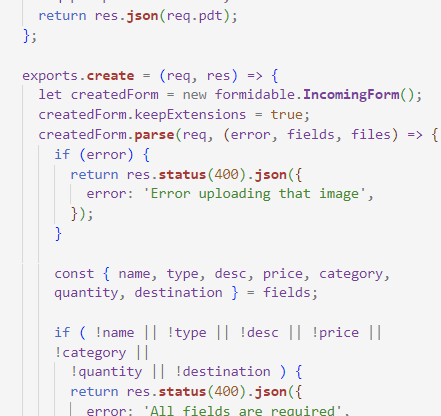
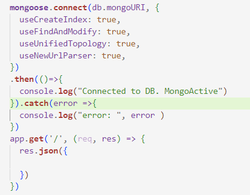

# Graceful shoes: A portfoliio project
An e-commerce backend project. The beginning
ESE BATA: Where matchless craftmanship meets graceful feet.)

https://www.linkedin.com/posts/olayemi-adekogbe_ese-bata-where-matchless-craftmanship-meets-activity-7242337829517725696-qE5a?utm_source=share&utm_medium=member_desktop
https://www.linkedin.com/in/olayemi-adekogbe
INSTALLATION: * Download and Install Node, a suitable code editor...
Check Package.json for a list of dependencies. Run npm "replaceWithDependencyName"
For an eCommerce shoe backend server
Collaboratrs:
* Doreen Ikilai
* Ifeoluwa Adebayo
* Favour
* WASSIM HAIMOUDI
Related Projects: Secondary GH Repo https://github.com/OluwaseunAI/zuri-shoe-project
https://github.com/ZeroAddict/Ese-Bata-landing/

I utilized Express, MongoDB, EJs within a NodeJS runtime server environment. Additionally, other libraries and frameworks were integrated to implement the Models-Views-Controllers (MVC) architecture. To ensure the project's success, thorough research and planning were conducted to identify technologies and algorithms best suited for the task at hand. Building on my existing NodeJS knowledge presented an unmistakeable choice, allowing me to expand my skills and expertise while cementing the little I know as I grow.
⦁	Users can login and or sign up through functional routes and control handlers when the endpoints are invoked, this was made possible by the Express framework.
⦁	User data and Product data can securely be stored, retrieved, modified and deleted using the MongoDB as a document-oriented database (NoSQL).
The choice of NodeJS allowed me run Javascript code seamlessly and with asynchronous execution on the server-side, anchored on its single-threaded, event-driven and non-blocking I/O model. Additionally, its array of modular packages managed by npm facilitated astute development, and management capacities.

